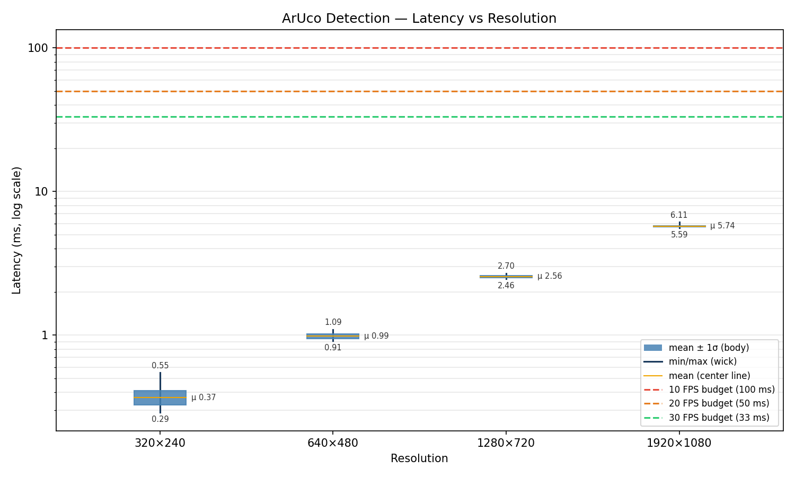
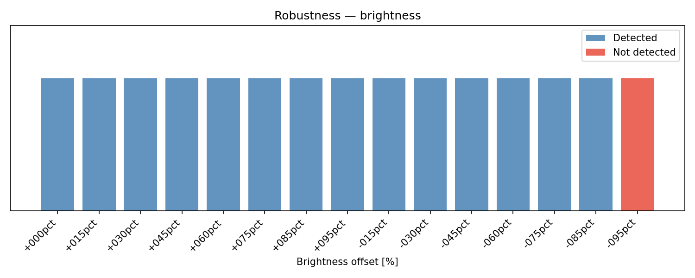
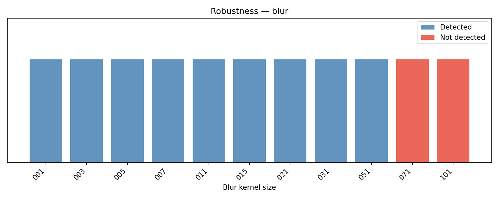
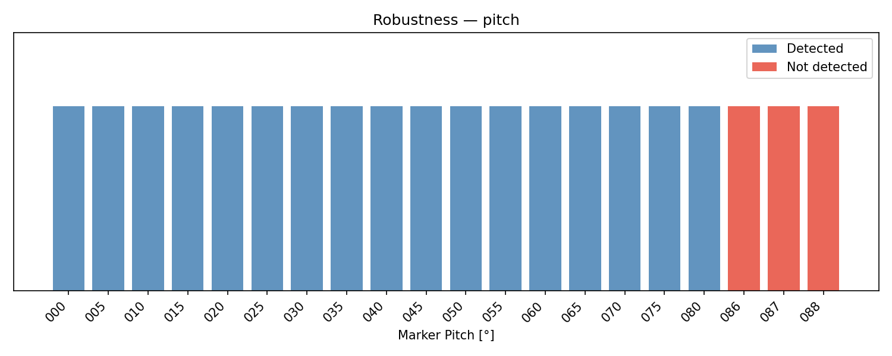
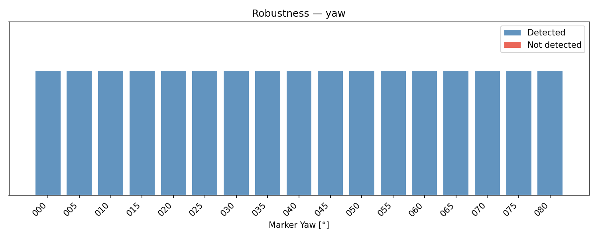
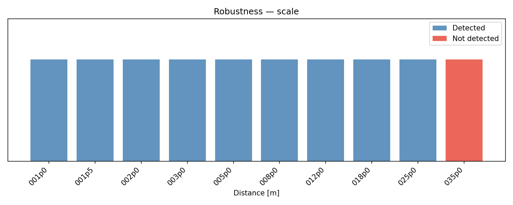
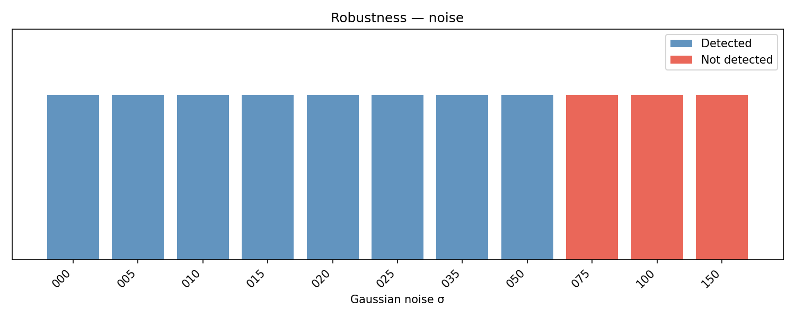

# Design Note: Vision-Based Landing Target Detection

## 1. Approach: Classical CV vs. ML

### Decision: ArUco (Classical CV)

| Criterion | Classical CV (ArUco) | ML (CNN) |
|---|---|---|
| Training data | None required | Thousands of labeled samples per scenario |
| Latency | Deterministic, ~1–5 ms | Variable, GC/interpreter overhead |
| Deployment | Single binary, zero runtime deps | Python runtime or TensorRT on Jetson |
| Generalization | Marker-specific, highly reliable | Generalizes but brittle to distribution shift |
| 6DoF pose | Built-in via `solvePnP` | Requires separate pose head or homography |
| Tuning | Config file swap | Retraining per new scenario |

**Conclusion:** Known marker + classical CV is strictly superior for this use case. ML adds cost with no benefit when the target is a controlled, known marker. A CNN would be appropriate if the landing pad has no fixed visual structure (e.g., arbitrary H-pads on unknown surfaces).

### Why ArUco specifically
- `DICT_4X4_50`: smallest dictionary → fastest detection, 50 IDs available if multi-marker needed later
- `solvePnP` gives direct metric 3D pose from four corner correspondences — no depth sensor needed
- `CORNER_REFINE_SUBPIX`: sub-pixel corner accuracy → lower reprojection error, more stable pose at range
- ID filtering (ID=0 only) eliminates false positives from stray markers in environment

---

## 2. Performance Considerations (Jetson Orin Nano)

**Target hardware:** Jetson Orin Nano — Arm Cortex-A78AE, power-capped embedded platform. No discrete GPU for inference workloads.

**Latency budget:**

| FPS target | Budget per frame |
|---|---|
| 30 FPS | 33.3 ms |
| 20 FPS | 50.0 ms |
| 10 FPS | 100.0 ms |

**Why C++:**
- No garbage collector → no latency spikes
- No Python interpreter on embedded system
- Single static binary, links OpenCV contrib at compile time
- `std::chrono::high_resolution_clock` timing — same as what Jetson will see

**Benchmark system: Apple M4**

| Property | Value |
|---|---|
| CPU | Apple M4 (4 P-cores + 6 E-cores) |
| P-core clock | ~3.7 GHz (boost) |
| SIMD | 128-bit NEON per core |
| Single-core FP32 throughput (NEON) | ~15 GFLOPS/core |
| Memory bandwidth | ~68 GB/s (LPDDR5X) |

**Measured latency (M4, N=200 frames, detection_rate=1.0 at all resolutions):**

| Resolution | min ms | mean ms | max ms |
|---|---|---|---|
| 320 × 240  | 0.29 | 0.37 | 0.55 |
| 640 × 480  | 0.91 | 0.99 | 1.09 |
| 1280 × 720 | 2.46 | 2.56 | 2.70 |
| 1920 × 1080| 5.59 | 5.74 | 6.11 |



All resolutions well within 30 FPS budget (33.3 ms) on M4.

---

**Jetson Orin Nano — estimated performance**

| Property | Value |
|---|---|
| CPU | 6-core Arm Cortex-A78AE |
| Clock | up to 1.5 GHz |
| SIMD | 128-bit NEON per core |
| Single-core FP32 throughput (NEON) | ~3 GFLOPS/core |
| Memory bandwidth | ~68 GB/s (LPDDR5, shared CPU+GPU) |

ArUco detection is single-threaded and CPU-bound (integer + SIMD image ops). Multi-core count irrelevant for per-frame latency.

**FLOPS-based scaling estimate:**

ArUco runtime scales roughly with pixel count × per-pixel work. Both chips use 128-bit NEON → same SIMD width. Performance difference is clock × IPC:

- M4 P-core: ~3.7 GHz, deutlich höhere IPC als A78AE → effective throughput ~15 GFLOPS/core
- A78AE: ~1.5 GHz, geringere IPC → effective throughput ~3 GFLOPS/core
- **Ratio: ~5×** (conservative; memory latency on Jetson may add further overhead)

**Estimated Jetson latency (M4 × 5):**

| Resolution | M4 mean ms | Jetson est. ms | 30 FPS budget (33.3 ms) |
|---|---|---|---|
| 320 × 240  | 0.37 | ~1.9  | ✓ headroom ×17 |
| 640 × 480  | 0.99 | ~5.0  | ✓ headroom ×6.7 |
| 1280 × 720 | 2.56 | ~12.8 | ✓ headroom ×2.6 |
| 1920 × 1080| 5.74 | ~28.7 | ⚠ ~86% budget used |

**Recommendation:** 1280×720 @ 30 FPS is the operating point. Provides 2.6× headroom for camera I/O, JSON serialization, and OS scheduling jitter. 1920×1080 leaves <5 ms margin — too tight for production.

> **Note:** These are rough FLOPS-based estimates. Actual Jetson numbers depend on memory latency under shared GPU load, cache behavior, and thermal throttling. Validate with `./build/bench_perf` on target hardware.

---

## 3. Failure Cases

### Lighting
- **Overexposure:** ArUco relies on binary threshold of black/white cells. Blown-out highlights destroy cell contrast → detection fails.
- **Underexposure / shadows:** Same mechanism — cells merge into uniform dark region.
- **Mitigation:** Adaptive thresholding in `ArucoDetector` handles moderate variation.
- **Measured limit:** Robust down to −85% brightness. Fails at −95% (near-black image).



### Motion Blur
- High-speed descent or rotation causes cell edges to smear → corner localization fails.
- **Measured limit:** Robust up to kernel size 51. Fails at kernel 71 and above.



### Extreme Viewing Angle (Pitch/Yaw)
- Marker foreshortening at high pitch angles compresses cells beyond detectable size.
- Yaw (rotation around marker normal) does not affect detection — one of the advantages over H/circle pads.
- **Measured pitch limit:** Robust up to 85°. Fails at 86° and above (marker nearly edge-on).
- **Measured yaw limit:** No failures across full 0°–80° range tested.





### Small Apparent Size / Distance
- At large distances the marker occupies too few pixels for reliable cell detection.
- **Measured limit:** Robust up to 25 m. Fails at 35 m (at 1280×720, 0.5 m marker, synthetic focal length).
- Actual max range scales with resolution and focal length — benchmark result is specific to `camera.yaml` parameters.



### Gaussian Noise
- **Measured limit:** Robust up to σ=50. Fails at σ=75 and above.



### Partial Occlusion
- Not benchmarked. ArUco requires all four corners visible — any occluded corner causes detection failure. `reprojection_error_px` will spike before full failure.

### False Positives
- `DICT_4X4_50` has Hamming distance ≥ 4 between codewords → robust against noise-induced false reads.
- ID filter (ID=0 only) rejects all other ArUco markers in scene.
- False positive rate in clean conditions: effectively 0.

---

## 4. Integration: Camera → Jetson → stdout

```
Camera
    │  raw frames
    ▼
LandingDetector + PoseEstimator   ← camera.yaml (intrinsics)
    │  DetectionResult (JSON, one line/frame)
    ▼
stdout pipe / IPC
```

**Key interface points:**

- **Calibration (one-time, pre-deployment):** `camera.yaml` must be obtained before deployment via `cv::calibrateCamera()` on the specific camera unit and lens. Checkerboard calibration → intrinsics + distortion coefficients → written to `camera.yaml`. Binary loads it at startup — no recompile needed.
- **Camera → Jetson:** Camera streams frames into the detection pipeline.
- **Output:** One JSON line per frame to stdout. Downstream process consumes `DetectionResult` — this system outputs raw perception only, no control commands.

**CameraSource status:** Stub implemented in `src/input/frame_source.cpp` — not tested on hardware.

**TODO:** Verify full pipeline on target hardware (camera input, latency, `CameraSource` integration).

---

## 5. Assumptions

| Assumption | Detail |
|---|---|
| Marker geometry known | 0.5 m × 0.5 m flat ArUco ID=0, `DICT_4X4_50` |
| Camera calibrated | `camera.yaml` uses estimated params. **Production requires `cv::calibrateCamera()` on the specific unit.** |
| Marker planar | `solvePnP` assumes flat marker — valid for rigid pad, not flexible surface |
| Single marker in FOV | ID filter assumes only one ID=0 marker present |
| Lighting within operational range | See Section 3. No active illumination compensation. |
| Camera rigidly mounted | No vibration isolation modeled. High vibration → effective motion blur. |
| Synthetic training proxy | Benchmark data generated with same distortion params as production — representative if calibration is accurate |
